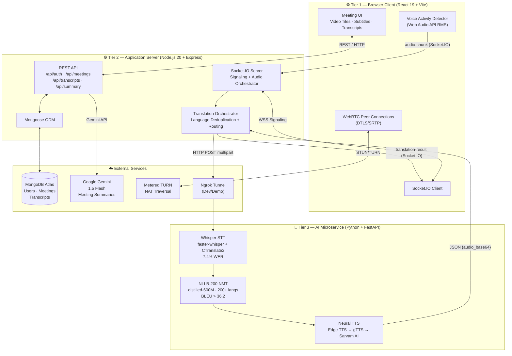
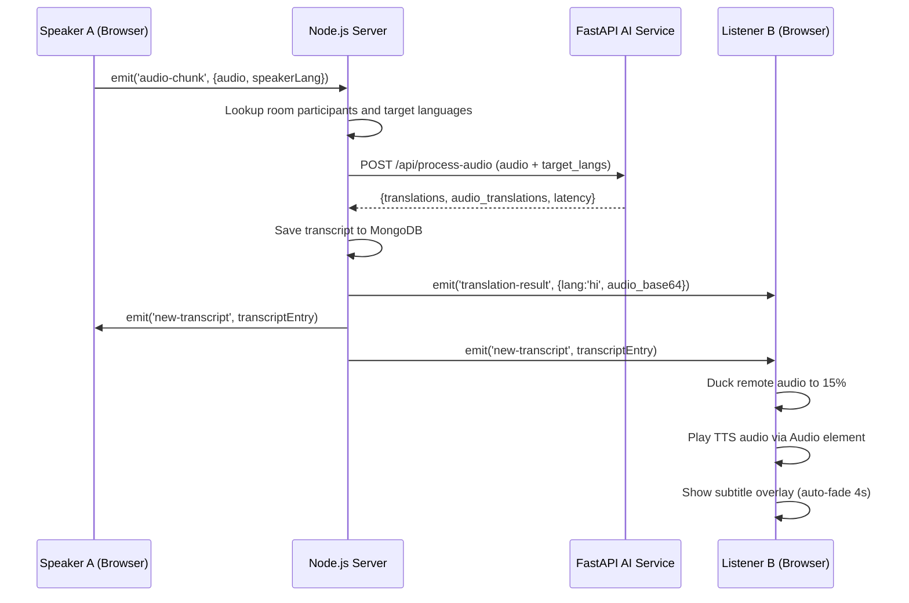
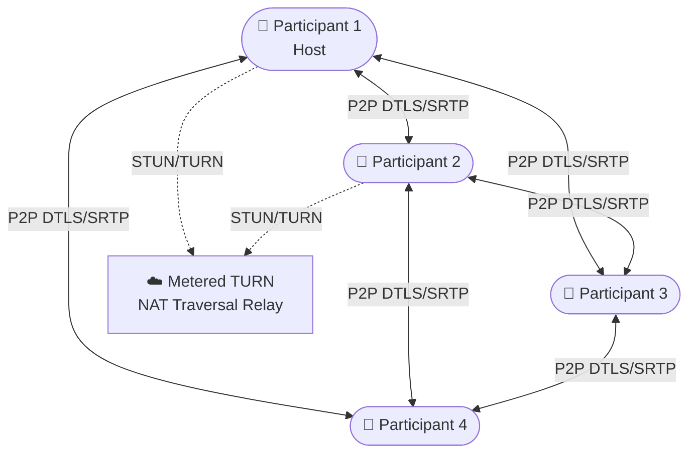
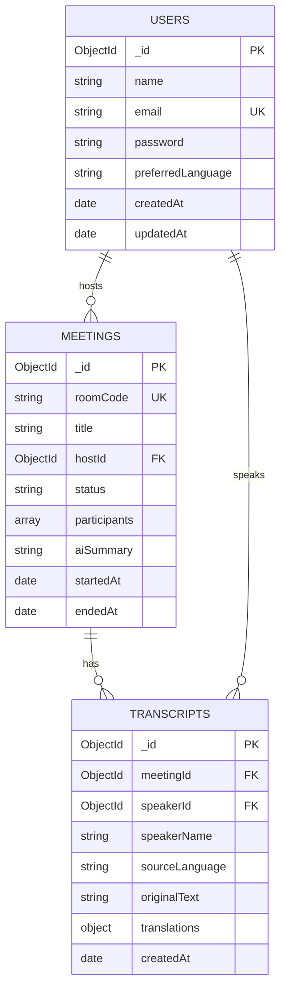
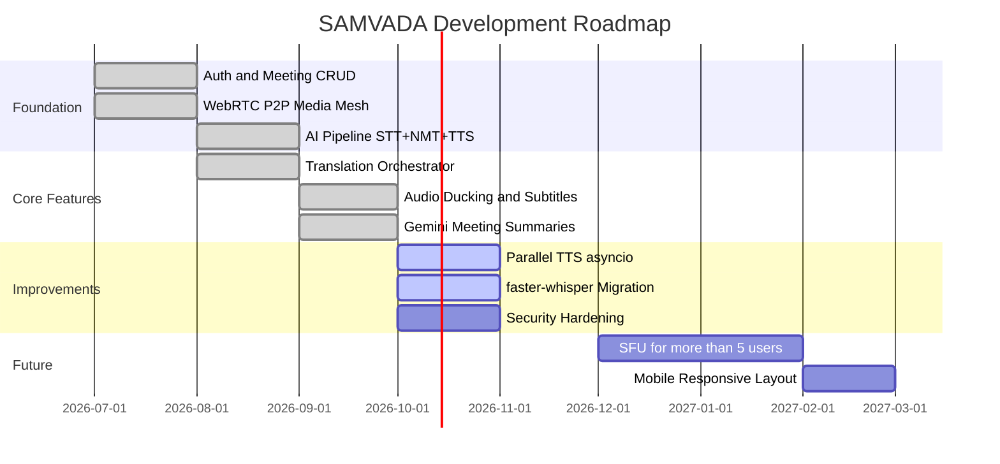

# SAMVADA

**S**peech **A**nd **M**ultilingual **V**oice **A**ssisted **D**ialog **A**pplication

> A distributed web-based video conferencing platform that delivers bidirectional, low-latency speech-to-speech translation across 12+ languages, powered by a cascaded neural AI pipeline.

---

## ✨ Key Highlights

- 🗣️ **Speech-to-Speech Translation** — participants speak in their native language and hear others in theirs
- ⚡ **~1.8s end-to-end latency** on NVIDIA T4 GPU with CTranslate2 INT8 quantization
- 🌍 **12 languages** — English, Hindi, French, Spanish, German, Japanese, Korean, Chinese, Arabic, Portuguese, Russian, Italian
- 🔇 **Audio ducking** — original speaker volume reduced 85% during translated playback to prevent acoustic clash
- 📝 **Live transcripts + AI summaries** — Gemini 1.5 Flash generates structured post-meeting summaries
- 👥 **Peer-to-peer WebRTC** — sub-200ms audio/video with zero media-server cost

---

## 🏗️ System Architecture

### High-Level Three-Tier Overview



---

### AI Processing Pipeline

```mermaid
flowchart LR
    A(["🎙️ Browser Mic"]) --> B["VAD\nRMS Energy\nSilence Window"]
    B -->|"WebM Blob\n~2.5s chunks"| C["Socket.IO\naudio-chunk"]
    C --> D["Translation\nOrchestrator\nNode.js"]
    D --> E["POST /api/process-audio"]

    subgraph FastAPI["🤖 FastAPI AI Microservice on GPU"]
        E --> F["Stage 1 · STT\nfaster-whisper\nCTranslate2 INT8\n~0.3–0.8s"]
        F -->|"text + detected_lang"| G["Stage 2 · NMT\nNLLB-200-distilled\nFlores-200 codes\n~0.1–0.3s / lang"]
        G -->|"translated texts"| H["Stage 3 · TTS\nEdge Neural TTS\ngTTS fallback\n~0.3–1.5s / lang"]
        H --> I["JSON Response\ntranslations + audio_base64"]
    end

    I --> J["Route to Listeners\nby target language"]
    J -->|"translation-result"| K["🔊 Listener Browser\nAudio Duck 85%\nSubtitle Overlay 4s"]
```



---

### Socket.IO Event Sequence



---

### WebRTC Mesh Topology



---

### Database Schema



---

## 🛠️ Tech Stack

| Layer | Technology | Version | Purpose |
|---|---|---|---|
| **Frontend** | React | 19.x | UI framework |
| | Vite | 8.x | Build tool + dev server |
| | Socket.IO Client | 4.7.x | Signaling + translation events |
| | WebRTC (native) | — | Peer-to-peer media |
| | Web Audio API | — | VAD + volume analysis |
| | TailwindCSS | 4.x | Utility-first styling |
| **Backend** | Node.js | 20+ | Server runtime |
| | Express | 4.x | HTTP framework |
| | Socket.IO | 4.7.5 | WebSocket server |
| | Mongoose | 8.x | MongoDB ODM |
| | JWT + bcryptjs | — | Auth |
| | Axios | 1.x | Gemini API client |
| **AI Service** | Python | 3.10+ | ML runtime |
| | FastAPI | 0.111 | HTTP microservice |
| | faster-whisper | ≥1.0 | ASR (CTranslate2 INT8) |
| | Meta NLLB-200 | distilled-600M | Neural machine translation |
| | Microsoft Edge TTS | — | Primary neural TTS |
| | gTTS | 2.5.1 | TTS fallback |
| | PyTorch | 2.x | GPU compute |
| **Database** | MongoDB Atlas | M0 free | Persistent storage |
| **External** | Google Gemini 1.5 Flash | — | AI meeting summaries |
| | Metered TURN | SaaS | NAT traversal |
| | Ngrok | — | Colab tunnel (dev) |

---

## 📁 Project Structure

```
samvada/
├── client/                     # React 19 + Vite frontend
│   ├── src/
│   │   ├── components/
│   │   │   ├── Meeting/        # MeetingRoom, ParticipantTile, SubtitleOverlay, ...
│   │   │   ├── Dashboard/      # CreateMeeting, JoinMeeting, ...
│   │   │   ├── Layout/         # AppShell, Sidebar, Topbar
│   │   │   └── ui/             # Design system (Button, Modal, Badge, ...)
│   │   ├── hooks/
│   │   │   ├── useAudioCapture.js       # Single mic+camera stream
│   │   │   ├── useWebRTC.js             # Mesh peer connection management
│   │   │   ├── useSpeechTranslation.js  # VAD + audio chunk emit
│   │   │   └── useTranslationReceiver.js # Receive + play translated audio
│   │   ├── pages/              # Meeting, Dashboard, Summary, Login, ...
│   │   ├── context/            # AuthContext, SocketContext
│   │   └── services/           # api.js (Axios), socket.js
│   └── .env.example
│
├── server/                     # Node.js + Express backend
│   ├── controllers/            # authController, meetingController, summaryController, ...
│   ├── models/                 # User.js, Meeting.js, Transcript.js
│   ├── routes/                 # auth.js, meetings.js, transcriptRoutes.js, ...
│   ├── socket/                 # index.js, meetingHandlers.js, signalingHandlers.js
│   ├── translation/            # orchestrator.js, aiClient.js
│   └── .env.example
│
├── ai-service/                 # Python FastAPI ML microservice
│   ├── app/
│   │   ├── main.py             # FastAPI app + routes
│   │   ├── pipeline.py         # SpeechToSpeechEngine (STT→NMT→TTS)
│   │   ├── stt.py              # faster-whisper ASR
│   │   ├── translator.py       # NLLB-200 NMT
│   │   ├── tts.py              # Edge TTS / gTTS / Sarvam AI
│   │   └── schemas.py          # Pydantic models
│   ├── requirements.txt
│   └── COLAB_INTEGRATION_GUIDE.md
│
├── docs/                       # Full technical documentation
│   ├── ARCHITECTURE.md
│   ├── AI_PIPELINE.md
│   ├── API.md
│   ├── DATABASE.md
│   ├── DEPLOYMENT.md
│   ├── PRD.md
│   ├── SECURITY.md
│   └── TECHNICAL_SPEC.md
│
└── package.json                # Root multi-service dev runner
```

---

## 🚀 Getting Started

### Prerequisites

| Requirement | Version | Notes |
|---|---|---|
| Node.js | 20+ | Client + Server |
| npm | 9+ | Package manager |
| MongoDB Atlas | — | Free M0 tier works |
| Google Colab | — | Free T4 GPU for AI service |
| Ngrok account | — | Free tier, for Colab tunnel |

---

### 1. Clone the Repository

```bash
git clone https://github.com/Saurabh1127/Final-year.git
cd Final-year
```

### 2. Start the AI Service on Google Colab

The AI service requires a GPU. Run it on [Google Colab](https://colab.research.google.com) with a free T4 GPU.

1. Open a new Colab notebook → **Runtime → Change runtime type → T4 GPU**
2. Run in order:

```python
# Cell 1 — Clone repo & install dependencies
import os, shutil
if os.path.exists("/content/Final-year"): shutil.rmtree("/content/Final-year")
os.system("git clone https://github.com/Saurabh1127/Final-year.git /content/Final-year")
os.chdir("/content/Final-year/ai-service")
os.system("pip install -q -r requirements.txt pyngrok")
```

```python
# Cell 2 — Configure models
import os
os.environ["WHISPER_MODEL"] = "large-v3"
os.environ["NLLB_MODEL"]    = "facebook/nllb-200-distilled-1.3B"
```

```python
# Cell 3 — Start server & expose via Ngrok
from pyngrok import ngrok
import subprocess
ngrok.set_auth_token("YOUR_NGROK_AUTH_TOKEN")
tunnel = ngrok.connect(8000, "http")
print(f"AI Service URL: {tunnel.public_url}")
subprocess.Popen(
    ["python", "-m", "uvicorn", "app.main:app", "--host", "0.0.0.0", "--port", "8000"]
)
```

Copy the printed Ngrok URL — you'll use it in steps 3 and 4.

---

### 3. Configure & Start the Server

```bash
cd server && npm install && cp .env.example .env
```

Edit `server/.env`:

```env
PORT=5000
MONGO_URI=mongodb+srv://<user>:<pass>@<cluster>.mongodb.net/samvada
JWT_SECRET=<run: node -e "console.log(require('crypto').randomBytes(64).toString('hex'))">
AI_SERVICE_URL=<ngrok-url-from-colab>
GEMINI_API_KEY=<your-gemini-api-key>
METERED_API_KEY=<your-metered-turn-api-key>
```

```bash
npm run dev  # Express + Socket.IO on http://localhost:5000
```

---

### 4. Configure & Start the Client

```bash
cd client && npm install && cp .env.example .env
```

Edit `client/.env`:

```env
VITE_API_URL=http://localhost:5000
VITE_AI_SERVICE_URL=<ngrok-url-from-colab>
```

```bash
npm run dev  # Vite dev server on http://localhost:5173
```

---

### 5. Start Everything at Once (from Root)

```bash
npm install && npm run dev
# Starts client (:5173) + server (:5000) concurrently
```

---

## 🌐 Supported Languages

| Code | Language | TTS Voice |
|---|---|---|
| `en` | English | en-US-GuyNeural |
| `hi` | Hindi | hi-IN-MadhurNeural |
| `fr` | French | fr-FR-HenriNeural |
| `es` | Spanish | es-ES-AlvaroNeural |
| `de` | German | de-DE-ConradNeural |
| `ja` | Japanese | ja-JP-KeitaNeural |
| `ko` | Korean | ko-KR-InJoonNeural |
| `zh` | Chinese | zh-CN-YunxiNeural |
| `ar` | Arabic | ar-SA-HamedNeural |
| `pt` | Portuguese | pt-BR-AntonioNeural |
| `ru` | Russian | ru-RU-DmitryNeural |
| `it` | Italian | it-IT-DiegoNeural |

---

## 📊 Performance Benchmarks

Measured on NVIDIA Tesla T4 GPU (Google Colab free tier).

| Stage | Model | P50 Latency | P95 Latency |
|---|---|---|---|
| ASR (STT) | faster-whisper large-v3 | ~0.5s | ~0.8s |
| NMT | NLLB-200-distilled-600M | ~0.15s / lang | ~0.3s / lang |
| TTS | Microsoft Edge Neural | ~0.5s / lang | ~1.5s / lang |
| **End-to-End** | **Full cascade** | **~1.8s** | **~3.2s** |

| Metric | Value |
|---|---|
| Word Error Rate (WER) | 7.4% (conversational) |
| BLEU Score (avg, 12 pairs) | > 36.2 |
| WebRTC media latency | < 200ms P2P |
| Max participants (MVP) | 5 (mesh limit) |

---

## 🗺️ Roadmap



---

## ⚠️ Known Limitations (MVP)

- **Max 5 participants** per room — WebRTC full-mesh limitation (N×(N-1)/2 connections)
- **Ephemeral AI service** — Google Colab sessions reset after ~12h of inactivity
- **Safari MediaRecorder** — partial WebM support; best experience on Chrome or Edge
- **Sequential TTS** — synthesized one language at a time; async parallel TTS planned for v2
- **No mobile layout** — desktop browser only for MVP

---

## 📚 Documentation & Guides

Comprehensive technical specifications, architecture diagrams, data flows, and benchmark figures are consolidated directly within this [README.md](README.md).

For step-by-step instructions on deploying the GPU AI microservice:
- 📖 **[Colab & Ngrok Setup Guide](ai-service/COLAB_INTEGRATION_GUIDE.md)** — Step-by-step instructions for launching Whisper, NLLB-200, and Edge-TTS on a free Tesla T4 GPU in Google Colab.

---

## 📄 License

Developed as a Final Year B.E. Computer Engineering project at **Thakur College of Engineering and Technology (TCET), Mumbai** — Academic Year 2026-27.

---

<div align="center">
  <strong>Built with React · Node.js · FastAPI · Whisper · NLLB-200 · WebRTC</strong>
</div>
