# SAMVADA: Complete Image Generation Prompts & Diagram Specifications

This standalone reference catalog contains all text-to-image prompts (for DALL-E 3, Midjourney v6, Flux/Stable Diffusion) and exact Mermaid diagram specifications for all figures in the Final Year Blue Book Project Report.

---

## Institutional Emblems

### Institutional Emblem Prompt
- **Target Document Locations**: Title Page, Certificate Page, Project Approval Certificate Page
- **Recommended Tool**: DALL-E 3 / Midjourney v6 / Institutional Vector Asset
- **Image Generation Prompt**:
> *Official Emblem and Seal of Thakur College of Engineering and Technology (TCET), Mumbai, depicting the academic crest, heraldic eagle/insignia, and college motto, high-resolution vector format, transparent or pure white background.*

---

## Master Table of Figures & Prompt Mapping

| Prompt # | Figure ID | Figure Caption / Description | Recommended Generation Tool |
|---|---|---|---|
| **Prompt #1** | **Figure 1.1** | High-Level Real-Time Cross-Lingual Video Communication Conceptual Flow | Mermaid Live / Draw.io + AI Image |
| **Prompt #2** | **Figure 2.1** | Cascaded vs. Unified Speech-to-Speech Translation Pipeline Comparison | Mermaid Live / Draw.io + AI Image |
| **Prompt #3** | **Figure 2.2** | Proposed SAMVADA Dual-Stream Distributed Architectural Flow | Mermaid Live / Draw.io + AI Image |
| **Prompt #4** | **Figure 3.1** | Agile Scrum Evolutionary Engineering Methodology | Mermaid Live / Draw.io + AI Image |
| **Prompt #5** | **Figure 3.2** | SAMVADA Full-Stack Technology Ecosystem | Mermaid Live / Draw.io + AI Image |
| **Prompt #6** | **Figure 3.3** | Project Work Breakdown Structure and Gantt Schedule Timeline | Mermaid Live / Draw.io + AI Image |
| **Prompt #7** | **Figure 3.4** | Structural Entity-Relationship and Data Association Model | Mermaid Live / Draw.io + AI Image |
| **Prompt #8** | **Figure 4.1** | SAMVADA Three-Tier Distributed System Architecture | Mermaid Live / Draw.io + AI Image |
| **Prompt #9** | **Figure 4.2** | Data Flow Diagram (DFD) Level 0: Context Analysis Diagram | Mermaid Live / Draw.io + AI Image |
| **Prompt #10** | **Figure 4.3** | Data Flow Diagram (DFD) Level 1: Subsystem Functional Decomposition | Mermaid Live / Draw.io + AI Image |
| **Prompt #11** | **Figure 4.4** | Data Flow Diagram (DFD) Level 2: AI Cascaded Pipeline & Buffer Subsystem | Mermaid Live / Draw.io + AI Image |
| **Prompt #12** | **Figure 4.5** | UML Use Case Diagram: Participant, Host, and AI Orchestrator Interactions | Mermaid Live / Draw.io + AI Image |
| **Prompt #13** | **Figure 4.6** | UML Class Diagram: Server Data Models, Controllers, and Service Layer | Mermaid Live / Draw.io + AI Image |
| **Prompt #14** | **Figure 4.7** | UML Sequence Diagram: WebRTC Signaling, Audio Chunking, and Translation | Mermaid Live / Draw.io + AI Image |
| **Prompt #15** | **Figure 4.8** | UML Component Diagram: Modular Architecture and Decoupled Services | Mermaid Live / Draw.io + AI Image |
| **Prompt #16** | **Figure 4.9** | UML Deployment Diagram: Physical Nodes, Cloud GPU, and Tunnel Topology | Mermaid Live / Draw.io + AI Image |
| **Prompt #17** | **Figure 4.10** | Flowchart: Client-Side RMS Energy Voice Activity Detection (VAD) Engine | Mermaid Live / Draw.io + AI Image |
| **Prompt #18** | **Figure 4.11** | Flowchart: Centralized Server Translation Orchestrator and Deduplication | Mermaid Live / Draw.io + AI Image |
| **Prompt #19** | **Figure 4.12** | Flowchart: AI Microservice Cascaded Inference Execution Engine | Mermaid Live / Draw.io + AI Image |
| **Prompt #20** | **Figure 4.13** | User Interface Layout: Device Configuration and Pre-Join Staging Screen | Text-to-Image (DALL-E 3 / Flux) |
| **Prompt #21** | **Figure 4.14** | User Interface Layout: Active Multilingual Video Conference Room View | Text-to-Image (DALL-E 3 / Flux) |
| **Prompt #22** | **Figure 4.15** | User Interface Layout: Pipeline Diagnostic Inspector and Latency Telemetry | Text-to-Image (DALL-E 3 / Flux) |
| **Prompt #23** | **Figure 4.16** | Audio Ducking and Jitter Buffer Sequential Playback Mechanism | Text-to-Image (DALL-E 3 / Flux) |
| **Prompt #24** | **Figure 5.1** | End-to-End Latency Breakdown Across Cascaded Processing Stages | Mermaid Live / Draw.io + AI Image |
| **Prompt #25** | **Figure 5.2** | Word Error Rate (WER) vs. Inference Latency Across Whisper Models | Text-to-Image (DALL-E 3 / Flux) |
| **Prompt #26** | **Figure 5.3** | Translation Quality (BLEU Score) Across 12 Evaluated Language Pairs | Text-to-Image (DALL-E 3 / Flux) |

---

## Prompt #1: Figure 1.1 — High-Level Real-Time Cross-Lingual Video Communication Conceptual Flow

- **Figure Identifier**: `Figure 1.1`
- **Official Caption**: *High-Level Real-Time Cross-Lingual Video Communication Conceptual Flow*

### 1. Text-to-Image Prompt (For AI Image Generators)
Copy and paste this prompt into DALL-E 3, Midjourney v6, or Flux:

> "A clean, modern, professional technical architectural illustration depicting real-time multilingual video conferencing between two users. On the left side, User A (Speaker) speaks in Spanish ('Hola, ¿cómo estás?') into a laptop microphone. An audio waveform flows into a central high-tech cloud AI pipeline showing three sequential glowing modern processing blocks: 1. Whisper ASR (Speech to Text), 2. NLLB-200 NMT (Neural Translation), 3. Edge Neural TTS (Speech Synthesis). The synthesized audio waveform and English text ('Hello, how are you?') then flow into User B's laptop on the right side, showing translated audio playing through headphones while the original video stream connects directly via WebRTC peer-to-peer. Sleek dark-mode enterprise UI, glowing cyan, purple, and royal blue accents, isometric 3D perspective, crisp vector style, labeled data streams, highly detailed, 8k resolution, white background."

### 2. Mermaid Diagram Specification (For Mermaid Live / Draw.io)
Copy and paste this into [Mermaid Live](https://mermaid.live) or draw.io to export high-res vector graphics:

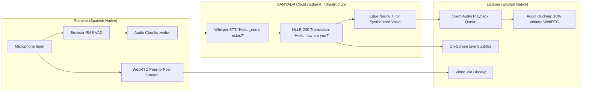

---

## Prompt #2: Figure 2.1 — Cascaded vs. Unified Speech-to-Speech Translation Pipeline Comparison

- **Figure Identifier**: `Figure 2.1`
- **Official Caption**: *Cascaded vs. Unified Speech-to-Speech Translation Pipeline Comparison*

### 1. Text-to-Image Prompt (For AI Image Generators)
Copy and paste this prompt into DALL-E 3, Midjourney v6, or Flux:

> "A highly detailed technical comparison diagram showing two architectural paradigms for Speech-to-Speech Translation (S2ST). The top section illustrates the 'Cascaded Pipeline' showing three distinct modular stages: Audio Input -> Faster-Whisper ASR -> NLLB-200 NMT -> Edge Neural TTS -> Audio Output, with intermediate text and token checkpoints highlighted. The bottom section illustrates the 'Unified End-to-End Model' (e.g., Meta SeamlessM4T) showing a single monolithic deep neural network processing speech directly to speech. Clean visual design with blue and purple glowing nodes, data flow arrows, latency badges (Cascaded: ~1.8s, Unified: ~2.0s), modular advantages callouts, modern technology aesthetic, white background, high resolution vector graphics."

### 2. Mermaid Diagram Specification (For Mermaid Live / Draw.io)
Copy and paste this into [Mermaid Live](https://mermaid.live) or draw.io to export high-res vector graphics:

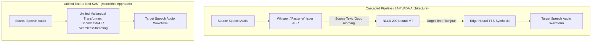

---

## Prompt #3: Figure 2.2 — Proposed SAMVADA Dual-Stream Distributed Architectural Flow

- **Figure Identifier**: `Figure 2.2`
- **Official Caption**: *Proposed SAMVADA Dual-Stream Distributed Architectural Flow*

### 1. Text-to-Image Prompt (For AI Image Generators)
Copy and paste this prompt into DALL-E 3, Midjourney v6, or Flux:

> "A comprehensive architectural flow diagram of the SAMVADA system. The diagram is split into three horizontal tiers: Tier 1 (Client Browser with React, WebRTC peer connection, and Web Audio RMS VAD), Tier 2 (Node.js Application & Socket.IO Translation Orchestrator Server), and Tier 3 (Python FastAPI AI Microservice with Whisper, NLLB-200, and Edge-TTS). Bright neon cyan arrows show the WebRTC direct peer-to-peer video/audio link between users. Deep purple and gold data lines show audio chunks streaming via Socket.IO to Tier 2, being deduplicated, forwarded to Tier 3 for cascaded inference, and returning translated speech and subtitles to Tier 1 listeners. Technical dark mode background, crisp isometric blocks, professional software engineering layout, 8k resolution, vector graphics."

### 2. Mermaid Diagram Specification (For Mermaid Live / Draw.io)
Copy and paste this into [Mermaid Live](https://mermaid.live) or draw.io to export high-res vector graphics:

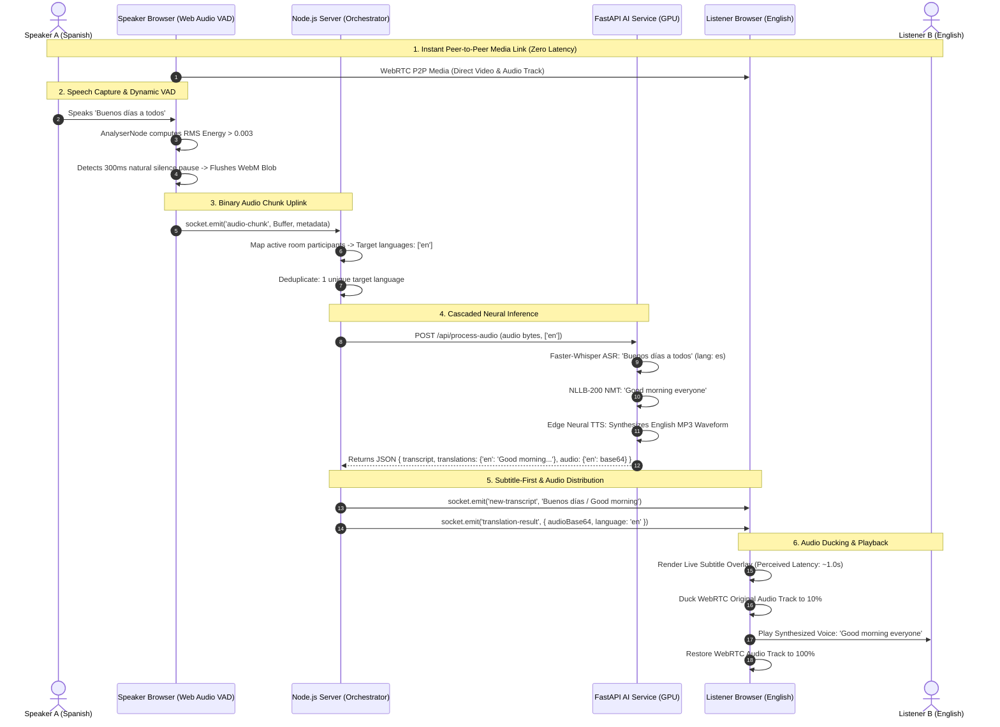

---

## Prompt #4: Figure 3.1 — Agile Scrum Evolutionary Engineering Methodology

- **Figure Identifier**: `Figure 3.1`
- **Official Caption**: *Agile Scrum Evolutionary Engineering Methodology*

### 1. Text-to-Image Prompt (For AI Image Generators)
Copy and paste this prompt into DALL-E 3, Midjourney v6, or Flux:

> "A professional software engineering methodology diagram illustrating an Agile Scrum sprint cycle tailored for AI and WebRTC systems. A central circular looping sprint arrow containing four stages: 1. Sprint Planning & Architectural Auditing, 2. Feature Implementation & Full-Stack Integration, 3. Empirical Latency Profiling & Benchmark Evaluation, 4. Sprint Review & Retrospective. Surrounding the circle are input backlogs (PRD, Technical Specs, Hardware Benchmarks) and output deliverables (Shippable WebRTC App, Accelerated AI Microservice, Diagnostic Telemetry). Modern clean vector graphics, corporate blue and emerald green palette, crisp typography, white background."

### 2. Mermaid Diagram Specification (For Mermaid Live / Draw.io)
Copy and paste this into [Mermaid Live](https://mermaid.live) or draw.io to export high-res vector graphics:

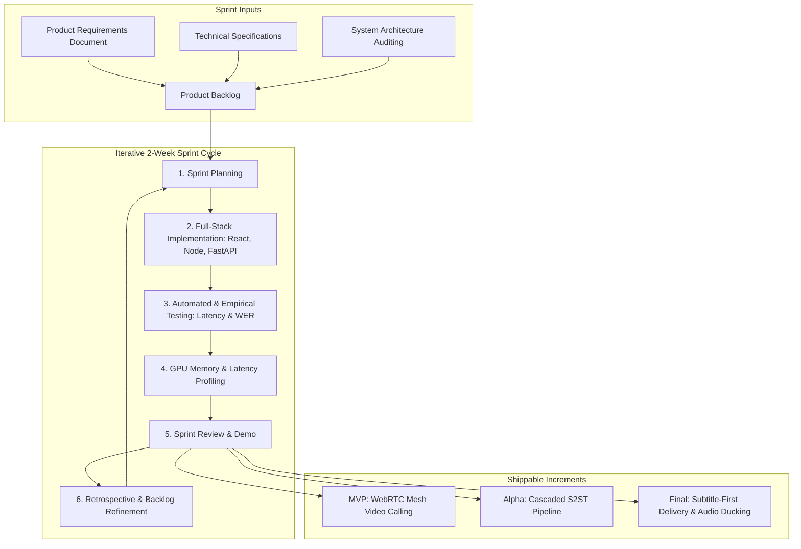

---

## Prompt #5: Figure 3.2 — SAMVADA Full-Stack Technology Ecosystem

- **Figure Identifier**: `Figure 3.2`
- **Official Caption**: *SAMVADA Full-Stack Technology Ecosystem*

### 1. Text-to-Image Prompt (For AI Image Generators)
Copy and paste this prompt into DALL-E 3, Midjourney v6, or Flux:

> "A visually stunning full-stack technology stack diagram displaying the SAMVADA ecosystem. Organized into four horizontal layers: 1. Frontend Client (React 19, Vite, WebRTC, Web Audio API, Lucide Icons), 2. Application Server (Node.js 20 LTS, Express, Socket.IO, Mongoose, Axios), 3. AI Inference Microservice (FastAPI, PyTorch, CTranslate2, Faster-Whisper, Meta NLLB-200, Edge-TTS), 4. Database & Infrastructure (MongoDB Atlas, NVIDIA Tesla T4, Ngrok Tunneling, STUN/TURN). Flat modern design with official technology brand icons, glowing connector lines, crisp vector layout, corporate enterprise blue and teal theme, white background."

### 2. Mermaid Diagram Specification (For Mermaid Live / Draw.io)
Copy and paste this into [Mermaid Live](https://mermaid.live) or draw.io to export high-res vector graphics:

```mermaid
graph TB
subgraph "Layer 1: Frontend Client (Browser SPA)"
React[React 19 SPA] --- Vite[Vite 8 Build Tool]
React --- WebRTC[WebRTC RTCPeerConnection]
React --- WebAudio[Web Audio API AnalyserNode]
React --- Worklets[AudioWorklets & MediaRecorder]
end

subgraph "Layer 2: Application & Signaling Server"
Node[Node.js 20 LTS] --- Express[Express 4.x REST API]
Node --- SocketIO[Socket.IO 4.7 Realtime Engine]
Node --- Orchestrator[Translation Orchestration Broker]
Node --- Mongoose[Mongoose 8 ODM]
end

subgraph "Layer 3: Neural AI Microservice (Cloud GPU)"
FastAPI[FastAPI Python 3.10] --- PyTorch[PyTorch 2.x & CUDA 12.1]
FastAPI --- FasterWhisper[Faster-Whisper CTranslate2 INT8]
FastAPI --- NLLB[Meta NLLB-200 distilled-600M]
FastAPI --- EdgeTTS[Microsoft Edge Neural TTS]
end

subgraph "Layer 4: Persistence & Network Infrastructure"
Mongo[MongoDB Atlas Cloud DB] --- Ngrok[Ngrok Secure Tunneling]
Ngrok --- STUN[Google Public STUN Relays]
STUN --- GPU[NVIDIA Tesla T4 16GB GPU]
end

Layer 1 <-->|WebSocket & WebRTC Mesh| Layer 2
Layer 2 <-->|HTTPS REST Multipart| Layer 3
Layer 2 <-->|Mongoose Driver| Layer 4
```

---

## Prompt #6: Figure 3.3 — Project Work Breakdown Structure and Gantt Schedule Timeline

- **Figure Identifier**: `Figure 3.3`
- **Official Caption**: *Project Work Breakdown Structure and Gantt Schedule Timeline*

### 1. Text-to-Image Prompt (For AI Image Generators)
Copy and paste this prompt into DALL-E 3, Midjourney v6, or Flux:

> "A high-resolution, modern engineering Gantt Chart and Work Breakdown Structure graphic. Horizontal timeline spanning Weeks 1 through 16, divided into four major milestones: 1. Core WebRTC & Signaling, 2. AI Inference Microservice, 3. Orchestration & VAD, 4. Optimization & Benchmarking. Clean colored horizontal task bars (blue, cyan, green, amber), milestone diamonds marking key delivery reviews, clear date axis, corporate project management styling, sharp typography, white background."

### 2. Mermaid Diagram Specification (For Mermaid Live / Draw.io)
Copy and paste this into [Mermaid Live](https://mermaid.live) or draw.io to export high-res vector graphics:

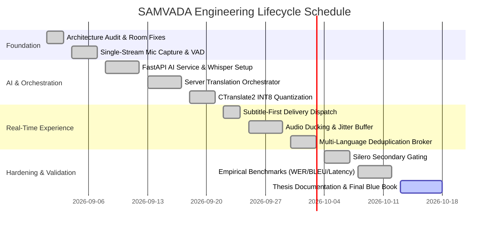

---

## Prompt #7: Figure 3.4 — Structural Entity-Relationship and Data Association Model

- **Figure Identifier**: `Figure 3.4`
- **Official Caption**: *Structural Entity-Relationship and Data Association Model*

### 1. Text-to-Image Prompt (For AI Image Generators)
Copy and paste this prompt into DALL-E 3, Midjourney v6, or Flux:

> "A clean, formal database Entity-Relationship (ER) diagram illustrating the data architecture of SAMVADA. Three primary entity boxes: 'User', 'Meeting', and 'Transcript'. User has fields: _id, name, email, passwordHash, preferredLanguage, createdAt. Meeting has fields: _id, roomCode, title, hostId, status, participants array (userId, displayName, targetLanguage, socketId, joinedAt), summary object. Transcript has fields: _id, meetingId, speakerId, speakerName, sourceLanguage, text, translations Map, timestamp. Crisp crow's foot notation showing 1-to-Many relationships, database primary and foreign key icons, modern software engineering design, white background."

### 2. Mermaid Diagram Specification (For Mermaid Live / Draw.io)
Copy and paste this into [Mermaid Live](https://mermaid.live) or draw.io to export high-res vector graphics:

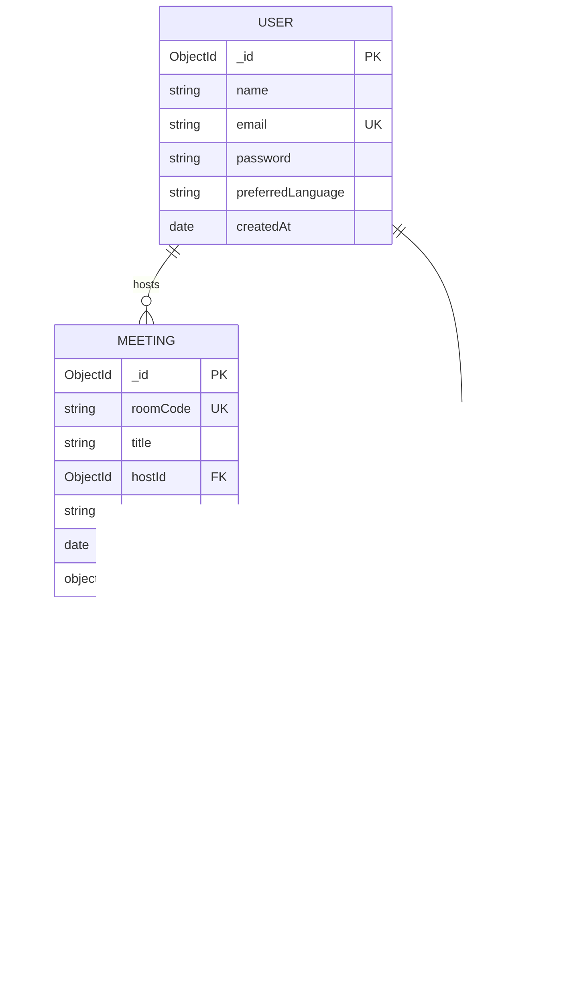

---

## Prompt #8: Figure 4.1 — SAMVADA Three-Tier Distributed System Architecture

- **Figure Identifier**: `Figure 4.1`
- **Official Caption**: *SAMVADA Three-Tier Distributed System Architecture*

### 1. Text-to-Image Prompt (For AI Image Generators)
Copy and paste this prompt into DALL-E 3, Midjourney v6, or Flux:

> "A highly professional, three-tier enterprise software architecture diagram. Tier 1 (top): Web Browser Client running React 19, showing WebRTC P2P mesh connection, Web Audio AnalyserNode VAD, MediaRecorder WebM Opus chunker, and AudioWorklet playback buffer. Tier 2 (middle): Application & Signaling Server (Node.js, Express REST API, Socket.IO real-time hub, Translation Orchestrator broker, and Mongoose ODM connected to MongoDB Atlas). Tier 3 (bottom): AI Inference Microservice (FastAPI running on an NVIDIA Tesla T4 GPU with Faster-Whisper ASR, Meta NLLB-200 NMT, and Microsoft Edge Neural TTS). Sleek isometric 3D blocks, clean data flow pipes with bidirectional arrows, glowing cyan, gold, and violet accents, modern technical blueprint aesthetic, white background, 8k resolution."

### 2. Mermaid Diagram Specification (For Mermaid Live / Draw.io)
Copy and paste this into [Mermaid Live](https://mermaid.live) or draw.io to export high-res vector graphics:

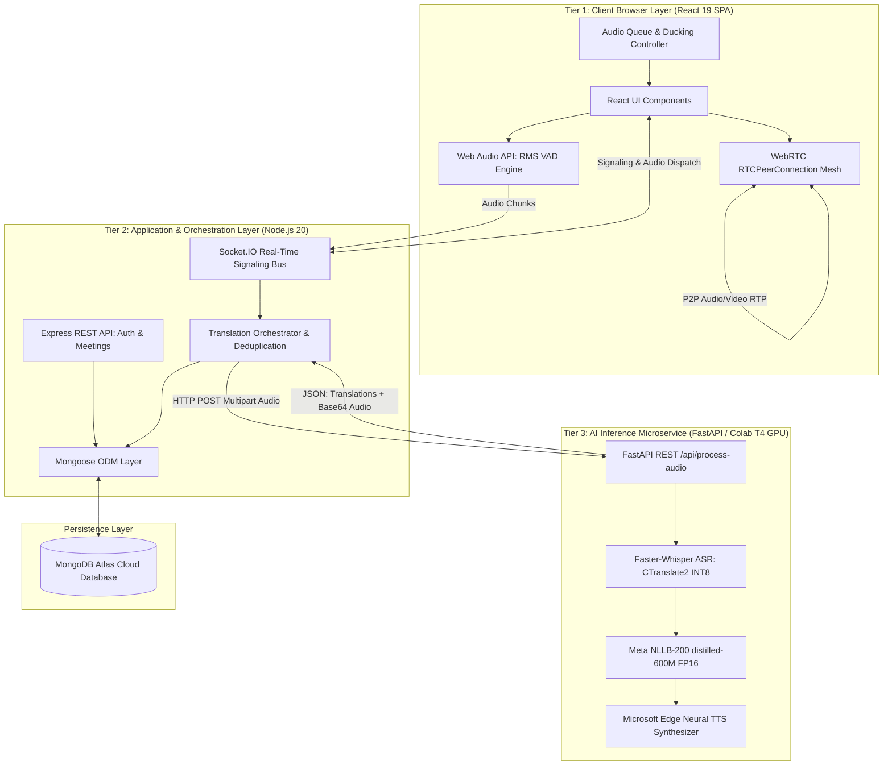

---

## Prompt #9: Figure 4.2 — Data Flow Diagram (DFD) Level 0: Context Analysis Diagram

- **Figure Identifier**: `Figure 4.2`
- **Official Caption**: *Data Flow Diagram (DFD) Level 0: Context Analysis Diagram*

### 1. Text-to-Image Prompt (For AI Image Generators)
Copy and paste this prompt into DALL-E 3, Midjourney v6, or Flux:

> "A formal Data Flow Diagram (DFD) Level 0 Context Diagram for a video conferencing speech translation system. A central large circular process labeled '0.0 SAMVADA Platform'. External rectangular entities: 'Meeting Participants (Speakers & Listeners)', 'MongoDB Cloud Database', and 'Microsoft Edge TTS Cloud'. Labeled arrows show data inputs (User Credentials, Room Codes, Acoustic Mic Stream, Language Preferences) and data outputs (Decrypted WebRTC Video/Audio, Translated Speech Waveforms, Live Bilingual Subtitles, Session Summaries). Standard Yourdon-DeMarco DFD symbology, crisp black and blue lines, high readability, white background."

### 2. Mermaid Diagram Specification (For Mermaid Live / Draw.io)
Copy and paste this into [Mermaid Live](https://mermaid.live) or draw.io to export high-res vector graphics:

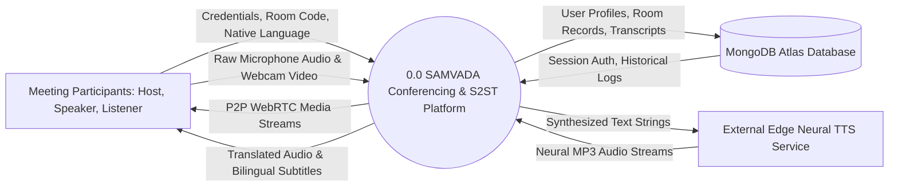

---

## Prompt #10: Figure 4.3 — Data Flow Diagram (DFD) Level 1: Subsystem Functional Decomposition

- **Figure Identifier**: `Figure 4.3`
- **Official Caption**: *Data Flow Diagram (DFD) Level 1: Subsystem Functional Decomposition*

### 1. Text-to-Image Prompt (For AI Image Generators)
Copy and paste this prompt into DALL-E 3, Midjourney v6, or Flux:

> "A formal DFD Level 1 diagram for SAMVADA. Four numbered circular processes: '1.0 User Authentication & Session Control', '2.0 WebRTC Signaling & Room Management', '3.0 Speech Chunking & Translation Orchestration', and '4.0 Cascaded AI Inference Pipeline'. Data stores for Users, Meetings, and Transcripts shown with open-ended rectangles. Arrows indicating precise data flows (JWT tokens, SDP offers/answers, WebM audio chunks, language tags, base64 audio frames). Clean technical documentation diagram, professional vector graphics, white background."

### 2. Mermaid Diagram Specification (For Mermaid Live / Draw.io)
Copy and paste this into [Mermaid Live](https://mermaid.live) or draw.io to export high-res vector graphics:

```mermaid
graph TD
User[User / Client]
P1((1.0 User Auth & Session Control))
P2((2.0 WebRTC Signaling & Room State))
P3((3.0 Audio Orchestration & Deduplication))
P4((4.0 Cascaded AI Inference Pipeline))

D1[[(D1: Users Store)]]
D2[[(D2: Meetings Store)]]
D3[[(D3: Transcripts Store)]]

User -->|Register/Login Request| P1
P1 <-->|Read/Write Credentials| D1
P1 -->|JWT Session Token| User

User -->|Create/Join Room Code| P2
P2 <-->|Room & Participant State| D2
P2 <-->|SDP Offer/Answer & ICE Candidates| User

User -->|WebM Audio Chunks via Socket.IO| P3
P2 -->|Active Participant Target Languages| P3
P3 -->|Multipart Audio & Target Lang Array| P4
P4 -->|Source Transcript + Translated Text + MP3 Audio| P3
P3 -->|Live Subtitles & Targeted Audio Frames| User
P3 -->|Persist Turn Data| D3
```

---

## Prompt #11: Figure 4.4 — Data Flow Diagram (DFD) Level 2: AI Cascaded Pipeline & Buffer Subsystem

- **Figure Identifier**: `Figure 4.4`
- **Official Caption**: *Data Flow Diagram (DFD) Level 2: AI Cascaded Pipeline & Buffer Subsystem*

### 1. Text-to-Image Prompt (For AI Image Generators)
Copy and paste this prompt into DALL-E 3, Midjourney v6, or Flux:

> "A highly detailed DFD Level 2 diagram illustrating the internal components of the AI Cascaded Translation Pipeline. Five sequential circular processes: '4.1 Audio Gating & Format Conversion', '4.2 Accelerated Speech-to-Text (Faster-Whisper)', '4.3 Multi-Target Neural Machine Translation (NLLB-200)', '4.4 Neural Speech Synthesis (Edge-TTS)', and '4.5 JSON Payload Assembly & Base64 Encoding'. Flow arrows depicting audio byte conversions, tokenized strings, Flores-200 mapping lookups, and MP3 byte streams. Elegant engineering drawing, sharp typography, white background."

### 2. Mermaid Diagram Specification (For Mermaid Live / Draw.io)
Copy and paste this into [Mermaid Live](https://mermaid.live) or draw.io to export high-res vector graphics:

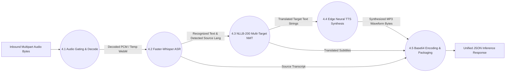

---

## Prompt #12: Figure 4.5 — UML Use Case Diagram: Participant, Host, and AI Orchestrator Interactions

- **Figure Identifier**: `Figure 4.5`
- **Official Caption**: *UML Use Case Diagram: Participant, Host, and AI Orchestrator Interactions*

### 1. Text-to-Image Prompt (For AI Image Generators)
Copy and paste this prompt into DALL-E 3, Midjourney v6, or Flux:

> "A formal UML Use Case Diagram for SAMVADA. Left stick-figure actor: 'Meeting Host'. Center stick-figure actor: 'Meeting Participant'. Right rectangular system actor: 'AI Orchestration Service'. Large system boundary box containing oval use cases: 'Register & Authenticate', 'Create Meeting Room', 'Join via Room Code', 'Configure Audio/Video Devices', 'Select Preferred Language', 'Stream WebRTC Video/Audio', 'Capture & VAD Segment Audio', 'Translate Speech-to-Speech', 'Display Live Subtitles', 'Duck Background Audio', 'Generate Post-Meeting Summary'. Include <<include>> and <<extend>> dependency arrows, standard UML notation, white background."

### 2. Mermaid Diagram Specification (For Mermaid Live / Draw.io)
Copy and paste this into [Mermaid Live](https://mermaid.live) or draw.io to export high-res vector graphics:

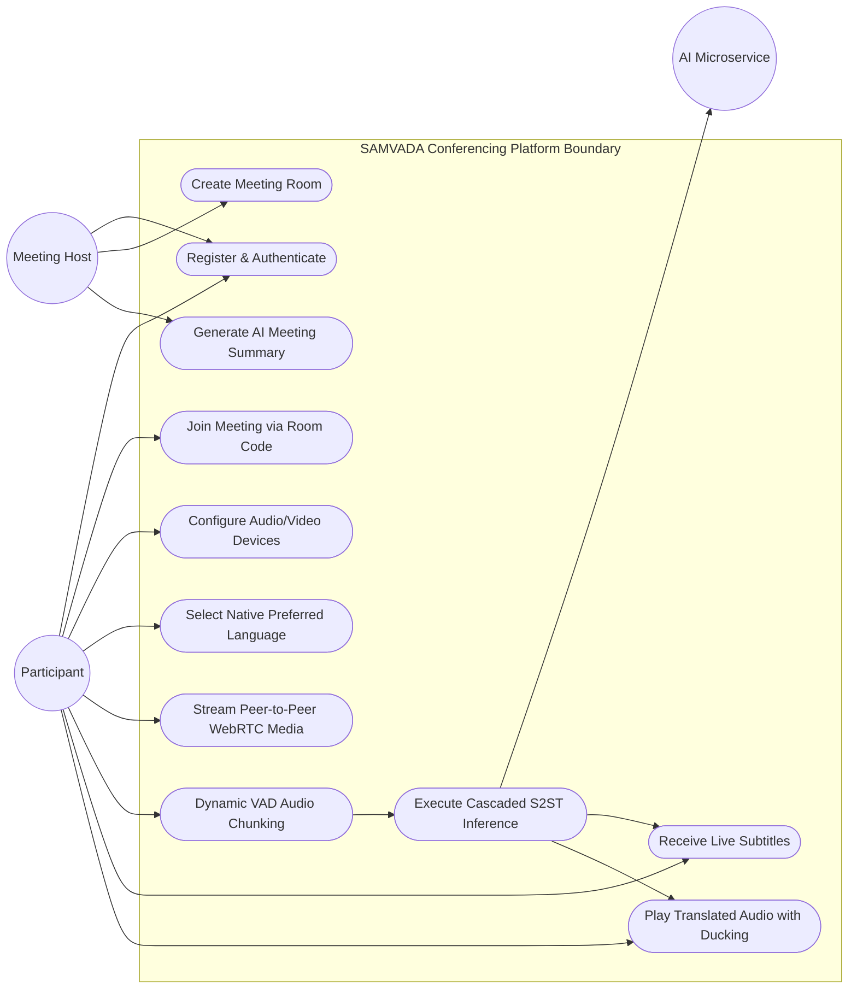

---

## Prompt #13: Figure 4.6 — UML Class Diagram: Server Data Models, Controllers, and Service Layer

- **Figure Identifier**: `Figure 4.6`
- **Official Caption**: *UML Class Diagram: Server Data Models, Controllers, and Service Layer*

### 1. Text-to-Image Prompt (For AI Image Generators)
Copy and paste this prompt into DALL-E 3, Midjourney v6, or Flux:

> "A detailed UML Class Diagram for the Node.js backend. Classes formatted with three compartments (class name, attributes, methods). Classes include: 'UserController', 'MeetingController', 'TranscriptController', 'MeetingService', 'Orchestrator', 'AIClient', and Mongoose data models 'User', 'Meeting', 'Transcript'. Clear association, aggregation, and dependency lines with multiplicities (1..*, 0..1), visibility indicators (+ public, - private), clean technical design, white background."

### 2. Mermaid Diagram Specification (For Mermaid Live / Draw.io)
Copy and paste this into [Mermaid Live](https://mermaid.live) or draw.io to export high-res vector graphics:

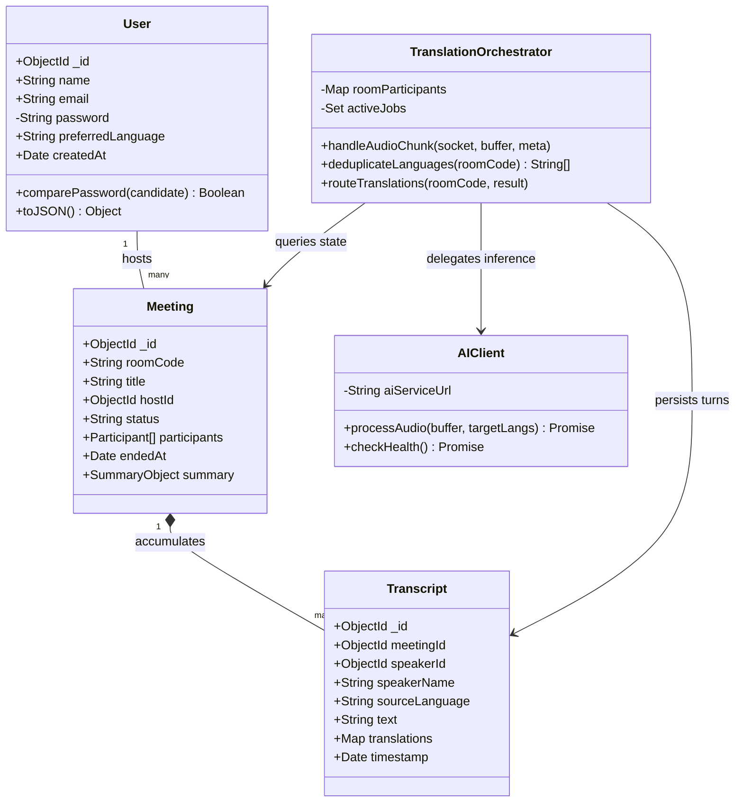

---

## Prompt #14: Figure 4.7 — UML Sequence Diagram: WebRTC Signaling, Audio Chunking, and Translation

- **Figure Identifier**: `Figure 4.7`
- **Official Caption**: *UML Sequence Diagram: WebRTC Signaling, Audio Chunking, and Translation*

### 1. Text-to-Image Prompt (For AI Image Generators)
Copy and paste this prompt into DALL-E 3, Midjourney v6, or Flux:

> "A formal UML Sequence Diagram showing the real-time execution flow between five vertical lifelines: 'Speaker Browser', 'Listener Browser', 'Signaling Server (Socket.IO)', 'Translation Orchestrator', and 'FastAPI AI Engine'. Message sequences numbered 1 to 14: SDP exchange, WebRTC P2P media streaming, RMS speech detection, binary audio-chunk emission, language deduplication, REST AI inference, subtitle event emission, translation-result audio emission, WebRTC volume ducking, and audio playback. Precise synchronous and asynchronous message arrows, return messages, activation boxes, white background."

### 2. Mermaid Diagram Specification (For Mermaid Live / Draw.io)
Copy and paste this into [Mermaid Live](https://mermaid.live) or draw.io to export high-res vector graphics:

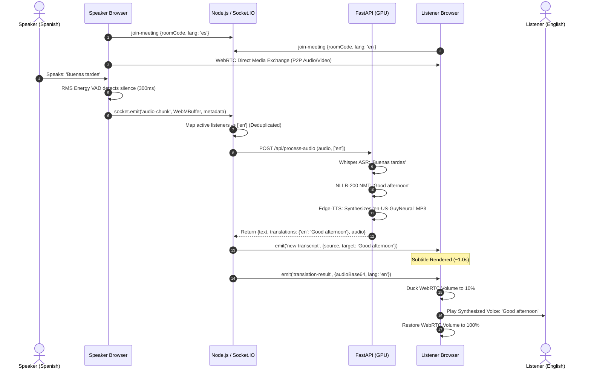

---

## Prompt #15: Figure 4.8 — UML Component Diagram: Modular Architecture and Decoupled Services

- **Figure Identifier**: `Figure 4.8`
- **Official Caption**: *UML Component Diagram: Modular Architecture and Decoupled Services*

### 1. Text-to-Image Prompt (For AI Image Generators)
Copy and paste this prompt into DALL-E 3, Midjourney v6, or Flux:

> "A UML 2.0 Component Diagram detailing the software components of SAMVADA. Client components: 'AudioCaptureModule', 'VADProcessor', 'WebRTCClient', 'TranslationPlaybackManager'. Server components: 'SignalingBroker', 'AuthModule', 'MeetingManager', 'TranslationOrchestrator'. AI Microservice components: 'FastAPIController', 'WhisperWorker', 'NLLBWorker', 'EdgeTTSWorker'. Ball-and-socket interface wiring, standard UML component boxes with two small tabs on the left, clear dependency stereotypes, white background."

### 2. Mermaid Diagram Specification (For Mermaid Live / Draw.io)
Copy and paste this into [Mermaid Live](https://mermaid.live) or draw.io to export high-res vector graphics:

```mermaid
graph TD
subgraph "Client Application Components"
[AudioCapture] ..> [VADProcessor]
[VADProcessor] --> [MediaChunker]
[WebRTCClient]
[AudioDuckingManager]
end

subgraph "Application Server Components"
[SignalingBroker]
[RoomManager]
[OrchestratorModule]
[TranscriptLogger]
end

subgraph "AI Microservice Components"
[FastAPIEndpoint]
[ASREngine: Whisper]
[NMTEngine: NLLB200]
[TTSEngine: EdgeTTS]
end

[MediaChunker] -->|WebSocket Binary| [OrchestratorModule]
[WebRTCClient] <-->|Signaling Events| [SignalingBroker]
[OrchestratorModule] -->|HTTP REST| [FastAPIEndpoint]
[FastAPIEndpoint] --> [ASREngine: Whisper]
[ASREngine: Whisper] --> [NMTEngine: NLLB200]
[NMTEngine: NLLB200] --> [TTSEngine: EdgeTTS]
[OrchestratorModule] -->|Audio Frames| [AudioDuckingManager]
[OrchestratorModule] --> [TranscriptLogger]
```

---

## Prompt #16: Figure 4.9 — UML Deployment Diagram: Physical Nodes, Cloud GPU, and Tunnel Topology

- **Figure Identifier**: `Figure 4.9`
- **Official Caption**: *UML Deployment Diagram: Physical Nodes, Cloud GPU, and Tunnel Topology*

### 1. Text-to-Image Prompt (For AI Image Generators)
Copy and paste this prompt into DALL-E 3, Midjourney v6, or Flux:

> "A formal UML Deployment Diagram showing physical hardware execution environments. Three 3D node cubes: 1. 'Client Device' (Chromium Browser, Web Audio API, React SPA artifacts), 2. 'Application Server Node' (Ubuntu Linux VM, Node.js 20 LTS runtime, Port 5000, Express, Socket.IO), 3. 'AI Compute Node' (Cloud GPU Server, NVIDIA Tesla T4 16GB, CUDA 12.1, Python 3.10, FastAPI, Port 8000). MongoDB Atlas shown as a database cylinder. Communication lines labeled with protocols: HTTPS (TCP 443), WSS (TCP 5000), DTLS/SRTP (UDP), and Ngrok secure tunnel. Standard UML deployment artifacts, white background."

### 2. Mermaid Diagram Specification (For Mermaid Live / Draw.io)
Copy and paste this into [Mermaid Live](https://mermaid.live) or draw.io to export high-res vector graphics:

```mermaid
graph TB
node1[Node: Client Workstation / Browser<br/>React 19 SPA, Web Audio API, WebRTC]
node2[Node: Application Host Server<br/>Ubuntu Linux, Node.js 20 LTS, Port 5000]
node3[Node: Cloud GPU AI Worker<br/>NVIDIA Tesla T4 16GB, CUDA 12.1, FastAPI Port 8000]
node4[(Node: MongoDB Atlas Cluster<br/>Cloud Database Service)]
stun[External Node: Google STUN Server<br/>stun:stun.l.google.com:19302]

node1 <-->|WebRTC DTLS/SRTP Media (UDP)| node1
node1 <-->|Signaling & Audio Chunks WSS (TCP 5000)| node2
node1 <-->|ICE Candidate Discovery (UDP 19302)| stun
node2 <-->|Mongoose Driver TCP 27017| node4
node2 <-->|Secure HTTP Tunnel / Ngrok (TCP 443)| node3
```

---

## Prompt #17: Figure 4.10 — Flowchart: Client-Side RMS Energy Voice Activity Detection (VAD) Engine

- **Figure Identifier**: `Figure 4.10`
- **Official Caption**: *Flowchart: Client-Side RMS Energy Voice Activity Detection (VAD) Engine*

### 1. Text-to-Image Prompt (For AI Image Generators)
Copy and paste this prompt into DALL-E 3, Midjourney v6, or Flux:

> "A structured programming flowchart showing the client-side Voice Activity Detection (VAD) decision process. Start node -> Sample Audio Float32 array -> Calculate RMS Energy -> Decision diamond: RMS >= 0.003? -> If YES: Accumulate speech frames, reset silence timer -> Decision diamond: Elapsed time >= 4000ms? -> If YES: Flush chunk -> If NO: Decision diamond: Silence duration >= 300ms? -> If YES: Flush chunk via WebSocket -> If NO: Continue loop. Crisp flowchart symbols, green and red condition branches, professional vector graphics, white background."

### 2. Mermaid Diagram Specification (For Mermaid Live / Draw.io)
Copy and paste this into [Mermaid Live](https://mermaid.live) or draw.io to export high-res vector graphics:

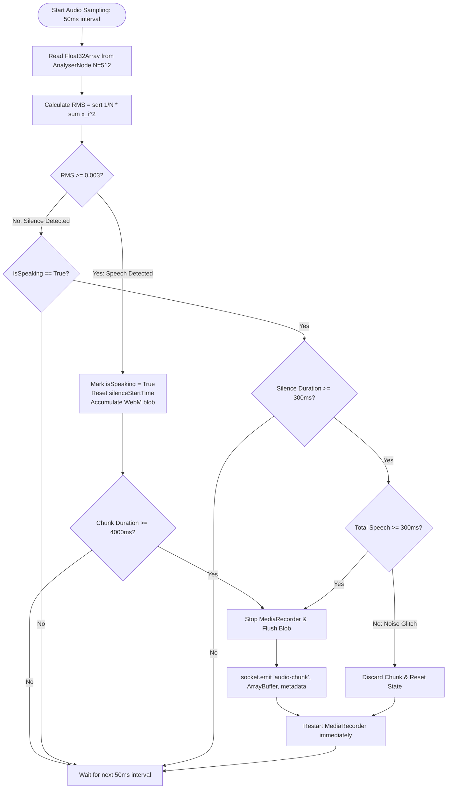

---

## Prompt #18: Figure 4.11 — Flowchart: Centralized Server Translation Orchestrator and Deduplication

- **Figure Identifier**: `Figure 4.11`
- **Official Caption**: *Flowchart: Centralized Server Translation Orchestrator and Deduplication*

### 1. Text-to-Image Prompt (For AI Image Generators)
Copy and paste this prompt into DALL-E 3, Midjourney v6, or Flux:

> "A technical flowchart illustrating the server-side translation orchestration and language deduplication logic. Node receives audio-chunk event -> Validate chunk size > 2000 bytes -> Retrieve room participant records -> Extract participant target languages -> Filter out source language -> Remove duplicates (unique target language set) -> Dispatch single HTTP POST to AI microservice -> Receive JSON response -> Broadcast new-transcript to all room sockets -> Iterate target languages -> Emit translation-result base64 audio exclusively to matching listener sockets. Clean software engineering flowchart, white background."

### 2. Mermaid Diagram Specification (For Mermaid Live / Draw.io)
Copy and paste this into [Mermaid Live](https://mermaid.live) or draw.io to export high-res vector graphics:

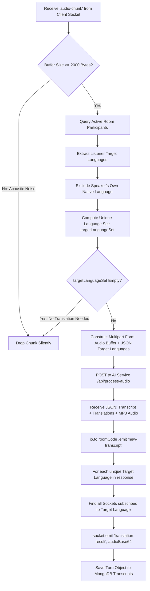

---

## Prompt #19: Figure 4.12 — Flowchart: AI Microservice Cascaded Inference Execution Engine

- **Figure Identifier**: `Figure 4.12`
- **Official Caption**: *Flowchart: AI Microservice Cascaded Inference Execution Engine*

### 1. Text-to-Image Prompt (For AI Image Generators)
Copy and paste this prompt into DALL-E 3, Midjourney v6, or Flux:

> "A detailed flowchart showing the multi-stage AI microservice execution. Ingest multipart request -> Write audio bytes to temporary buffer -> Faster-Whisper ASR: transcribe audio -> Extract source text and detected language -> Loop unique target languages -> Meta NLLB-200 NMT: translate tokens -> Edge Neural TTS: synthesize MP3 audio bytes -> Encode base64 -> Package JSON response -> Return HTTP 200. Professional programming flowchart, white background."

### 2. Mermaid Diagram Specification (For Mermaid Live / Draw.io)
Copy and paste this into [Mermaid Live](https://mermaid.live) or draw.io to export high-res vector graphics:

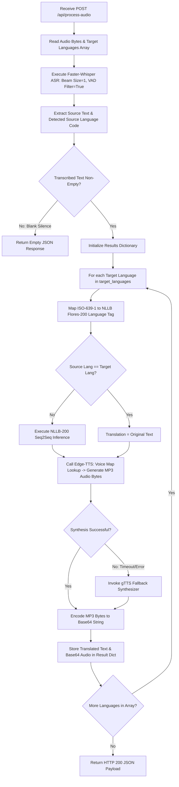

---

## Prompt #20: Figure 4.13 — User Interface Layout: Device Configuration and Pre-Join Staging Screen

- **Figure Identifier**: `Figure 4.13`
- **Official Caption**: *User Interface Layout: Device Configuration and Pre-Join Staging Screen*

### 1. Text-to-Image Prompt (For AI Image Generators)
Copy and paste this prompt into DALL-E 3, Midjourney v6, or Flux:

> "A modern, sleek dark-mode UI mockup of the SAMVADA Pre-Join Staging Screen. Center left: Live circular webcam preview video feed with microphone volume meter fluctuating in green. Center right: Clean card container with input fields for 'Display Name', dropdown for 'Select Native Preferred Language' (showing English, Hindi, Spanish flags), audio input device selector, camera selector, and a prominent glowing cyan 'Join Meeting' button. Top header with SAMVADA logo. Minimalist Figma design aesthetic, dark charcoal (#0F172A) background, modern typography, white vector layout."

---

## Prompt #21: Figure 4.14 — User Interface Layout: Active Multilingual Video Conference Room View

- **Figure Identifier**: `Figure 4.14`
- **Official Caption**: *User Interface Layout: Active Multilingual Video Conference Room View*

### 1. Text-to-Image Prompt (For AI Image Generators)
Copy and paste this prompt into DALL-E 3, Midjourney v6, or Flux:

> "A high-fidelity mockup of the active SAMVADA video conference room. Main stage: 2x2 grid of participant video tiles with rounded corners. Each tile features an avatar or video feed, participant name tag, and target language pill badge ('EN', 'ES', 'HI'). The active speaker's tile is highlighted with an elegant glowing cyan border. Bottom overlay: Floating semi-transparent glassmorphic subtitle banner displaying live bilingual captions ('Original: Hola a todos | Translated: Hello everyone'). Bottom control bar: Rounded buttons for Mic mute, Camera toggle, Language switch, Screen share, Pipeline Inspector, and Leave Room. Dark theme, professional UI/UX, 8k resolution."

---

## Prompt #22: Figure 4.15 — User Interface Layout: Pipeline Diagnostic Inspector and Latency Telemetry

- **Figure Identifier**: `Figure 4.15`
- **Official Caption**: *User Interface Layout: Pipeline Diagnostic Inspector and Latency Telemetry*

### 1. Text-to-Image Prompt (For AI Image Generators)
Copy and paste this prompt into DALL-E 3, Midjourney v6, or Flux:

> "A modern dark-mode diagnostic modal dashboard for developer telemetry. Title: 'SAMVADA Real-Time Pipeline Inspector'. Left panel: Live latency breakdown waterfall bar chart showing VAD Chunking (400ms), Uplink (80ms), Whisper ASR (320ms), NLLB NMT (180ms), Edge-TTS (450ms), and Playback Buffer (120ms). Total Latency: 1.55s. Right panel: Scrolling console log displaying recent speech chunks, detected language confidence, raw transcript text, translated target tokens, and audio buffer sizes. Sleek monospace typography, cyberpunk green and electric blue telemetry graphs, dark slate container."

---

## Prompt #23: Figure 4.16 — Audio Ducking and Jitter Buffer Sequential Playback Mechanism

- **Figure Identifier**: `Figure 4.16`
- **Official Caption**: *Audio Ducking and Jitter Buffer Sequential Playback Mechanism*

### 1. Text-to-Image Prompt (For AI Image Generators)
Copy and paste this prompt into DALL-E 3, Midjourney v6, or Flux:

> "A visual technical diagram showing audio ducking and sequential queue playback. Top timeline: Original Speaker Audio Track playing at 100% volume. When translated audio chunk arrives, the volume drops sharply to 10% (ducked zone shaded in soft amber). Bottom timeline: AI Translated Audio Waveform (bright blue) playing during the ducked interval. Once translated playback concludes, the original audio smoothly ramps back up to 100%. An audio jitter queue showing sequential FIFO ordering of translated speech packets. Clean vector illustration, audio waveform graphics, white background."

---

## Prompt #24: Figure 5.1 — End-to-End Latency Breakdown Across Cascaded Processing Stages

- **Figure Identifier**: `Figure 5.1`
- **Official Caption**: *End-to-End Latency Breakdown Across Cascaded Processing Stages*

### 1. Text-to-Image Prompt (For AI Image Generators)
Copy and paste this prompt into DALL-E 3, Midjourney v6, or Flux:

> "A clean, publication-grade horizontal stacked bar chart and latency breakdown diagram. The chart illustrates the cumulative delay across the six pipeline stages: 1. Client Speech Chunking (1,150ms), 2. Socket.IO Uplink (85ms), 3. Faster-Whisper ASR (340ms), 4. NLLB-200 NMT (180ms), 5. Edge Neural TTS (460ms), 6. Client Audio Buffer (120ms). Total Latency: 2,335ms (~2.3 seconds). An annotated dashed vertical line at 1,755ms marks 'Subtitle Display to Listener', highlighting that subtitles appear 580ms before synthesized speech begins. Modern academic aesthetics, professional color scheme, labeled data bars, white background."

### 2. Mermaid Diagram Specification (For Mermaid Live / Draw.io)
Copy and paste this into [Mermaid Live](https://mermaid.live) or draw.io to export high-res vector graphics:

```mermaid
gantt
title End-to-End Timeline of a Single Spoken Turn (3.0s Utterance)
dateFormat X
axisFormat %s ms

section Speaker Action
Spoken Utterance (3000ms)          :active, spk, 0, 3000
VAD Pause Detection (300ms)        :crit, vad, 3000, 3300

section Network & Server
Binary Socket.IO Uplink            :net1, 3300, 3385
Orchestrator Deduplication         :orch, 3385, 3400

section Cloud GPU AI Microservice
Faster-Whisper ASR Inference       :ai1, 3400, 3740
NLLB-200 Multilingual NMT          :ai2, 3740, 3920
Edge-TTS Speech Synthesis          :ai3, 3920, 4380

section Listener Experience
Subtitle-First Render              :milestone, sub, 3950, 3950
Translated Audio Playback Begins   :crit, play, 4500, 7200
WebRTC Audio Ducked (10%)          :active, duck, 4500, 7200
```

---

## Prompt #25: Figure 5.2 — Word Error Rate (WER) vs. Inference Latency Across Whisper Models

- **Figure Identifier**: `Figure 5.2`
- **Official Caption**: *Word Error Rate (WER) vs. Inference Latency Across Whisper Models*

### 1. Text-to-Image Prompt (For AI Image Generators)
Copy and paste this prompt into DALL-E 3, Midjourney v6, or Flux:

> "An academic scatter and line plot showing Word Error Rate (WER % on the Y-axis, lower is better) versus GPU Inference Latency (milliseconds on the X-axis, lower is better). Data points for Whisper Tiny (WER 14.8%, 95ms), Whisper Base (WER 11.2%, 160ms), Faster-Whisper Small INT8 (WER 7.4%, 338ms - highlighted as Optimal Operating Point with a gold star), Whisper Small PyTorch (WER 7.5%, 1,120ms), and Whisper Large-v3 (WER 5.1%, 1,850ms). Crisp gridlines, legend, axis labels, professional publication plot style, white background."

---

## Prompt #26: Figure 5.3 — Translation Quality (BLEU Score) Across 12 Evaluated Language Pairs

- **Figure Identifier**: `Figure 5.3`
- **Official Caption**: *Translation Quality (BLEU Score) Across 12 Evaluated Language Pairs*

### 1. Text-to-Image Prompt (For AI Image Generators)
Copy and paste this prompt into DALL-E 3, Midjourney v6, or Flux:

> "A multi-colored horizontal bar chart illustrating the BLEU translation accuracy scores for 12 language pairs translated by Meta NLLB-200-distilled-600M in the SAMVADA system. Languages include English to Spanish (41.5), English to French (39.8), English to Hindi (34.2), English to German (36.1), English to Japanese (31.4), Hindi to English (35.6), Spanish to English (42.0), French to English (40.4), German to English (37.2), and Japanese to English (32.1). An annotated vertical line indicates the threshold of 'High Quality Translation' at 30.0 BLEU. Clean publication design, distinct color palette, white background."

---
